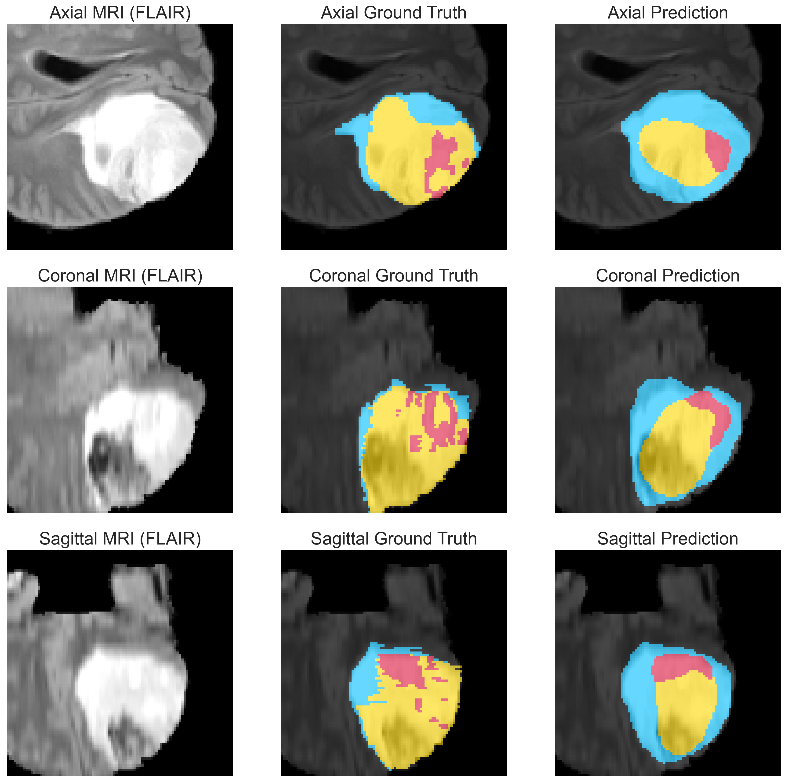

# UNET_BTS

INITIAL DOCX
### Project title and description

**Title: Resource-Conscious 3D U-Net Models for Brain Tumor Segmentation: An Ablation Study**

#### 1. Abstract:

Accurate brain tumor segmentation is critical for diagnosis and treatment planning, but current state-of-the-art
methods like nnU-Net are computationally demanding. This
work explores lightweight 3D U-Net variants tailored for
resource-limited settings. Using the BraTS 2020 dataset,
we compared three preprocessing pipelines and conducted
ablations on baseline and optimized models, incorporat-
ing residual blocks, attention gates, deep supervision, nor-
malization refinements, dropout tuning, and class-weighted
loss. The best model achieved Dice scores of 0.880 (WT),
0.812 (TC), and 0.691 (ET), showing consistent improve-
ments over the baseline while still remaining computation-
ally efficient. These results highlight the trade-off between
efficiency and absolute accuracy, and point to practical
strategies for segmentation under limited GPU resources.

#### 2. Project Structure
 ```
UNET_BTS/
├── .gitattributes
├── .gitignore
├── demo.ipynb
├── README.md
├── requirements.txt
│
├── .ipynb_checkpoints/ # Jupyter auto-saves
│ ├── demo-checkpoint.ipynb
│ ├── README-checkpoint.md
│ ├── requirements-checkpoint.txt
│ ├── test-checkpoint.ipynb
│ └── UNET Test-checkpoint.ipynb
│
├── data/ # (Git Ignored)
│ ├── processed/
│ │ └── cache/
│ └── raw/
│
├── models/
│ ├── .ipynb_checkpoints/
│ ├── model comparison/
│ │ ├── Model2_noDrop_P2_s5.pth
│ │ └── optModel1_classweight_P2_s5.pth
│ └── pipeline ablation/
│ ├── unet_P1_s0.pth
│ ├── unet_P1_s1.pth
│ ├── unet_P1_s2.pth
│ ├── unet_P2_s0.pth
│ ├── unet_P2_s1.pth
│ ├── unet_P2_s2.pth
│ ├── unet_P3_s0.pth
│ ├── unet_P3_s1.pth
│ └── unet_P3_s2.pth
│
├── results/
│ ├── .ipynb_checkpoints/
│ │ ├── all_pipelines_history-checkpoint.csv
│ │ ├── all_results-checkpoint.csv
│ │ └── P1_history_0-checkpoint.csv
│ │
│ ├── Images/
│ │ └── report images/
│ │ ├── Allpipelines_TrainVal_loss.png
│ │ ├── ModelComparison1.png
│ │ └── pipelines visuals.png
│ │
│ ├── model comparison/
│ │ ├── base/
│ │ │ ├── all_pipelines_history.csv
│ │ │ ├── all_results.csv
│ │ │ └── P2_history_5.csv
│ │ └── optimized/
│ │ ├── model1/
│ │ │ ├── Model_1_history.csv
│ │ │ ├── Model_1_P2_history_5.csv
│ │ │ ├── Model_1_results.csv
│ │ │ └── .ipynb_checkpoints/
│ │ │ ├── Model_1_history-checkpoint.csv
│ │ │ ├── Model_1_P2_history_5-checkpoint.csv
│ │ │ └── Model_1_results-checkpoint.csv
│ │ ├── model2/
│ │ │ ├── Model_2_all_results.csv
│ │ │ ├── Model_2_history.csv
│ │ │ └── Model_2_P2_history_5.csv
│ │ ├── model2_Nodropout/
│ │ │ ├── Model_2_Nodropout_all_results.csv
│ │ │ ├── Model_2_Nodropout_history.csv
│ │ │ └── Model_2_Nodropout_P2_history_5.csv
│ │ └── model2_Nodropout_classWeights/
│ │ ├── Model2_classweight_history.csv
│ │ ├── Model2_classweight_results.csv
│ │ └── P2_history_5.csv
│ │
│ ├── pipeline ablation/
│ │ ├── all_pipelines_history.csv
│ │ ├── all_results.csv
│ │ ├── P1_history_0.csv
│ │ ├── P1_history_1.csv
│ │ ├── P1_history_2.csv
│ │ ├── P2_history_0.csv
│ │ ├── P2_history_1.csv
│ │ ├── P2_history_2.csv
│ │ ├── P3_history_0.csv
│ │ ├── P3_history_1.csv
│ │ └── P3_history_2.csv
│ │
│ └── sample_predictions/
│
└── utils/
├── data_loader.py
├── metrics.py
├── run_train_eval.py
├── seeding.py
├── train_unet.py
├── unet.py
├── visualize.py
│
├── .ipynb_checkpoints/
│ ├── data_loader-checkpoint.py
│ ├── evaluate_unet-checkpoint.py
│ ├── metrics-checkpoint.py
│ ├── run_train_eval-checkpoint.py
│ ├── seeding-checkpoint.py
│ ├── train_unet-checkpoint.py
│ ├── unet-checkpoint.py
│ └── visualize-checkpoint.py
│
└── pycache/
├── ablation_loader.cpython-312.pyc
├── data_loader.cpython-312.pyc
├── evaluate_unet.cpython-312.pyc
├── metrics.cpython-312.pyc
├── run_train_eval.cpython-312.pyc
├── seeding.cpython-312.pyc
├── train_unet.cpython-312.pyc
├── unet.cpython-312.pyc
├── unet_test.cpython-312.pyc
└── visualize.cpython-312.pyc
```            


#### 3. Setup

    a. Clone repo:
        - git clone https://github.com/Blaq2011/UNET_BTS.git

    b. Install requirements
        - pip install -r requirements.txt

    c. Create directories and folders ignored by git (see project structure).
   
    d. Get Dataset
        - Download the BraTS 2020 dataset from: https://www.kaggle.com/datasets/awsaf49/brats20-dataset-training-validation?resource=download-directory 
        - Extract dataset in data/raw/.
        - Preprocessed data are saved automatically in data/processed/cache


#### 4. Usage
    --> Open the main notebook (demo.ipynb)

    a. Dataset Preparation
        Download the BraTS2020 Training Dataset and place it under data/raw/.
        Example directory structure:
        ``` 
        data/
        raw/
            BraTS2020_TrainingData/
            MICCAI_BraTS2020_TrainingData/
                BraTS20_Training_001/
                BraTS20_Training_001_flair.nii
                BraTS20_Training_001_t1.nii
                BraTS20_Training_001_t1ce.nii
                BraTS20_Training_001_t2.nii
                BraTS20_Training_001_seg.nii
                ...

        ``` 
        Use get_brats_filepaths() to collect file paths for all patients, then apply split_brats_dataset() to generate training/validation splits (default 80/20).


    b. Preprocessing and Caching
        The preprocessing pipeline ensures consistent input volumes by:
                - Intensity clipping to remove outliers (0.5th–99.5th percentile).
                - Cropping to nonzero brain regions with margin.
                - Resampling volumes and masks to a fixed shape of 128×128×128.
                - Normalizing each modality within the brain foreground.

        For efficiency, preprocessed data can be cached using build_cache(). Three caching strategies (pipelines) are supported:
                - P1: On-the-fly preprocessing during training.
                - P2: Cached full volumes with patch extraction at runtime.
                - P3: Cached random patches saved to disk.

        Caching improves reproducibility and speeds up training by avoiding repeated preprocessing


    c. Dataset Pipelines
        Each pipeline has a dataset class:
                - BraTSDatasetP1 (on-the-fly)
                - BraTSDatasetP2 (cached volumes)
                - BraTSDatasetP3 (cached patches)

        Create datasets and wrap them in PyTorch DataLoaders for batch training. For example, P2 was often used for experiments due to its balance of efficiency and consistency:

        ``` 
        train_dataset_P2 = BraTSDatasetP2(cache_dir="data/processed/cache/train/volumes", patient_ids=train_pids, patch_size=(96,96,96), augment=True)
        val_dataset_P2   = BraTSDatasetP2(cache_dir="data/processed/cache/val/volumes",   patient_ids=val_pids,   patch_size=(96,96,96), augment=False)

        train_loader_P2 = DataLoader(train_dataset_P2, batch_size=1, shuffle=True, num_workers=4, pin_memory=True)
        val_loader_P2   = DataLoader(val_dataset_P2,   batch_size=1, shuffle=False, num_workers=4, pin_memory=True)
        ``` 


    d. Model Training
        Two main U-Net architectures are included:
                - Baseline U-Net (M1): vanilla 3D U-Net.
                - Optimized U-Net Variants (M2–M5): progressively adding residual connections, attention gates, deep supervision, normalization refinements, dropout tuning, and class-weighted loss.

        Training is performed using run_train_eval(), which handles:
                - Training/validation loops.
                - Loss computation (Dice + Cross-Entropy).
                - Early stopping and learning-rate scheduling.
                - Saving checkpoints and logs.
        
        Example training call for the optimized model:
        ``` 
        df_hist, df_summary = run_train_eval(
            seeds=[5],
            pipelines={"P2": (train_loader_P2, val_loader_P2)},
            model_fn=lambda: UNet3D_Optimized_2(in_ch=4, out_ch=4, base_ch=32, dropout=0, deep_supervision=True),
            loss_fn_fn=lambda: DiceCELoss(class_weights=torch.tensor([0.10, 0.20, 0.30, 0.40]).to(device)),
            optimizer_fn=lambda model: torch.optim.AdamW(model.parameters(), lr=1e-4, weight_decay=1e-5),
            scheduler_fn=lambda opt: torch.optim.lr_scheduler.ReduceLROnPlateau(opt, mode="min", factor=0.5, patience=5, min_lr=1e-6),
            early_stopping=True,
            epochs=50,
            patience=10,
            lr=1e-4,
            device=device,
            results_dir="results/model comparison/optimized"
        )
        ``` 


    e. Model Evaluation
        - Quantitative metrics: Per-class Dice scores, BraTS composite Dice (WT, TC, ET), and HD95 are logged and saved.
        - Qualitative checks: Consistency of patch sampling across pipelines (patch_consistency_test) and visualization of model inputs (visualize_patient_consistency).
        - Training dynamics: Loss and Dice trajectories can be plotted with plot_model_comparison().


    f. Visualization of Predictions
        Trained models can be loaded and applied to validation data. Predictions are visualized across axial, coronal, and sagittal slices using visualize_prediction_multiview(). 
        The output figure shows:
                - FLAIR MRI input.
                - Ground truth segmentation mask.
                - Predicted segmentation.

        Classes are color-coded: background (black), non-enhancing core (yellow), edema (blue), and enhancing tumor (red).

        Example usage:
        '''
        best_ckpt = "models/model comparison/Model2_classweight_P2_s5.pth"
        state_dict = torch.load(best_ckpt, map_location=device, weights_only=False)

        model = UNet3D_Optimized_2(in_ch=4, out_ch=4, base_ch=32, dropout=0, deep_supervision=True)
        model.load_state_dict(state_dict)
        model.to(device)

        visualize_prediction_multiview(model, val_loader_P2, device, title="U-Net_P2")
        '''

    g. Results and Comparisons
        - Multiple U-Net variants (M1–M5) were compared using validation Dice scores and training dynamics.
        - Optimized models (M3–M5) demonstrated consistent improvements over the baseline, especially for tumor core (TC).
        - Class weighting (M5) further improved segmentation balance, although enhancing tumor (ET) remained the most challenging region.


#### 5. Results

| Model             | Dice (Whole Tumor)   | Notes                        |
| ----------------- | ------------------   | ---------------------------- |
| Baseline U-Net    | 0.867                |  limited GPU   |
| Optimized U-Net   | 0/990                |  Class-Weighted loss, no dropout |
| nnU-Net (Fabian+) | \~0.88–0.90          |  BraTS 2020 winner            | 


- Qualitative Results


#### 6. References

[1] [Olaf Ronneberger, Philipp Fischer, and Thomas Brox. *U-Net: Convolutional networks for biomedical image segmentation.* arXiv preprint arXiv:1505.04597 (2015).](https://arxiv.org/abs/1505.04597)  

[2] [Özgün Çiçek, Ahmed Abdulkadir, Soeren S. Lienkamp, Thomas Brox, and Olaf Ronneberger. *3D U-Net: Learning dense volumetric segmentation from sparse annotation.* In MICCAI, 2016.](https://arxiv.org/abs/1606.06650)  

[3] [Fabian Isensee, Paul F. Jaeger, Simon A. A. Kohl, Jens Petersen, and Klaus H. Maier-Hein. *nnU-Net: a self-configuring method for deep learning-based biomedical image segmentation.* Nature Methods, 18(2):203–211 (2021).](https://www.nature.com/articles/s41592-020-01008-z) 

[4] [Mohammad Havaei, Nicolas Guizard, Nicolas Chapados, and Yoshua Bengio. *Brain tumor segmentation with deep neural networks.* Medical Image Analysis, 35:18–31 (2017).](https://arxiv.org/abs/1505.03540)

[5] [Kaiming He, Xiangyu Zhang, Shaoqing Ren, and Jian Sun. *Deep residual learning for image recognition.* In CVPR, 2016.](https://www.cv-foundation.org/openaccess/content_cvpr_2016/papers/He_Deep_Residual_Learning_CVPR_2016_paper.pdf))  

[6] [Nitish Srivastava, Geoffrey Hinton, Alex Krizhevsky, Ilya Sutskever, and Ruslan Salakhutdinov. *Dropout: A simple way to prevent neural networks from overfitting.* Journal of Machine Learning Research, 15(1):1929–1958 (2014).](https://jmlr.org/papers/volume15/srivastava14a/srivastava14a.pdf)  

[7] [Ozan Oktay, Jo Schlemper, Loïc Le Folgoc, Matthew Lee, Mattias P. Heinrich, Kazunari Misawa, Kensaku Mori, Steven McDonagh, Nils Y. Hammerla, Bernhard Kainz, Ben Glocker, and Daniel Rueckert. *Attention U-Net: Learning where to look for the pancreas.* arXiv preprint arXiv:1804.03999 (2018).](https://arxiv.org/abs/1804.03999)  

[8] [Chen-Yu Lee, Saining Xie, Patrick Gallagher, Zhengyou Zhang, and Zhuowen Tu. *Deeply-supervised nets.* In AISTATS (2015). ](https://arxiv.org/abs/1409.5185)  

[9] [Bastian H. Menze, András Jakab, Stefan Bauer, Jayashree Kalpathy-Cramer, Keyvan Farahani, John Kirby, Yvette Burren, Nicolas Porz, Jens Slotboom, Roland Wiest, and Koen van Leemput. *The multimodal brain tumor image segmentation benchmark (BRATS).* IEEE Transactions on Medical Imaging, 34(10):1993–2024 (2015).](https://pmc.ncbi.nlm.nih.gov/articles/PMC4833122/)

[10][Roey Mechrez, Jacob Goldberger, and Hayit Greenspan.Patch-based segmentation with spatial consistency: Application to ms lesions in brain mri. International Journal of Biomedical Imaging, 2016(1):7952541, 2016.](https://onlinelibrary.wiley.com/doi/10.1155/2016/7952541)

[11] [Yuxin Wu and Kaiming He. *Group normalization.* In ECCV, 2018.](https://arxiv.org/abs/1803.08494)  

[12] [Jie Hu, Li Shen, and Gang Sun. *Squeeze-and-excitation networks.* In CVPR, 2018, pages 7132–7141.](https://openaccess.thecvf.com/content_cvpr_2018/papers/Hu_Squeeze-and-Excitation_Networks_CVPR_2018_paper.pdf) 

[13] [Fabian Isensee, Paul F. Jaeger, Peter M. Full, Philipp Voll-muth, and Klaus H. Maier-Hein. nnu-net for brain tumor segmentation, 2020.](https://arxiv.org/abs/2011.00848)


Note: This implementation is designed for educational purposes under GPU memory constraints. Performance is not expected to match state-of-the-art methods.
